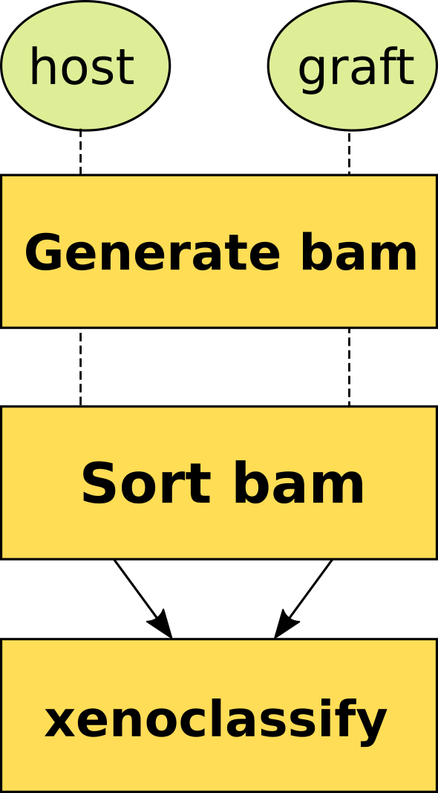

# xenoClassify

Xenoclassify 1.5: This Seqware workflow classifies short-read sequencing data generated from xenograft samples using [XenoClassify](https://github.com/oicr-gsi/xenoclassify).

 


## Overview

This workflow aligns reads to Host and Graft reference genomes, classifies and filters data. There is a built-in support for single- and multi-lane alignment for RNA-seq

## Dependencies

* [samtools 1.14](https://github.com/samtools/samtools/archive/1.14.tar.gz)
* [xenoclassify 1.0](https://github.com/oicr-gsi/xenoclassify/archive/1.1.tar.gz)


## Usage

### Cromwell
```
java -jar cromwell.jar run xenoclassify.wdl --inputs inputs.json
```

### Inputs

#### Required workflow parameters:
Parameter|Value|Description
---|---|---
`inputs`|Array[InputGroup]|Array of fastq files for read 1 and 2 along with rG string
`reference`|String|The reference of Graft to align the data with by either STAR or BWA
`libraryDesign`|String|Supported library design acronym. We support WG, EX, TS, WT and MR. Default is WG


#### Optional workflow parameters:
Parameter|Value|Default|Description
---|---|---|---
`hostReference`|String|"mm10"|The reference for host, most of the time it is mouse mm10
`outputFileNamePrefix`|String|""|Output file name prefix
`filterSupAlignments`|Boolean|true|Remove supplemental alignments from WT data (default true)


#### Optional task parameters:
Parameter|Value|Default|Description
---|---|---|---
`generateHostBamWG.adapterTrimmingLog_timeout`|Int|48|Hours before task timeout
`generateHostBamWG.adapterTrimmingLog_jobMemory`|Int|12|Memory allocated indexing job
`generateHostBamWG.indexBam_timeout`|Int|48|Hours before task timeout
`generateHostBamWG.indexBam_modules`|String|"samtools/1.9"|Modules for running indexing job
`generateHostBamWG.indexBam_jobMemory`|Int|12|Memory allocated indexing job
`generateHostBamWG.bamMerge_timeout`|Int|72|Hours before task timeout
`generateHostBamWG.bamMerge_modules`|String|"samtools/1.9"|Required environment modules
`generateHostBamWG.bamMerge_jobMemory`|Int|32|Memory allocated indexing job
`generateHostBamWG.runBwamem2_timeout`|Int|96|Hours before task timeout
`generateHostBamWG.runBwamem2_jobMemory`|Int|32|Memory allocated for this job
`generateHostBamWG.runBwamem2_threads`|Int|8|Requested CPU threads
`generateHostBamWG.runBwamem2_addParam`|String?|None|Additional BWA parameters
`generateHostBamWG.adapterTrimming_timeout`|Int|48|Hours before task timeout
`generateHostBamWG.adapterTrimming_jobMemory`|Int|16|Memory allocated for this job
`generateHostBamWG.adapterTrimming_addParam`|String?|None|Additional cutadapt parameters
`generateHostBamWG.adapterTrimming_adapter2`|String|"AGATCGGAAGAGCGTCGTGTAGGGAAAGAGTGT"|Adapter sequence to trim from read 2
`generateHostBamWG.adapterTrimming_adapter1`|String|"AGATCGGAAGAGCACACGTCTGAACTCCAGTCAC"|Adapter sequence to trim from read 1
`generateHostBamWG.adapterTrimming_trimMinQuality`|Int|0|Minimum quality of read ends to keep
`generateHostBamWG.adapterTrimming_trimMinLength`|Int|1|Minimum length of reads to keep
`generateHostBamWG.adapterTrimming_umiLength`|Int|5|The number of bases to trim when doUMItrim is true. If the given length is positive, the bases are removed from the beginning of each read. If it is negative, the bases are removed from the end
`generateHostBamWG.adapterTrimming_doUMItrim`|Boolean|false|If true, do umi trimming
`generateHostBamWG.adapterTrimming_modules`|String|"cutadapt/1.8.3"|Required environment modules
`generateHostBamWG.extractUMIs_timeout`|Int|12|Time in hours before task timeout
`generateHostBamWG.extractUMIs_jobMemory`|Int|24|Memory allocated for this job
`generateHostBamWG.extractUMIs_modules`|String|"barcodex-rs/0.1.2 rust/1.45.1"|Required environment modules
`generateHostBamWG.extractUMIs_pattern2`|String|"(?P<umi_1>^[ACGT]{3}[ACG])(?P<discard_1>T)|(?P<umi_2>^[ACGT]{3})(?P<discard_2>T)"|UMI RegEx pattern 2
`generateHostBamWG.extractUMIs_pattern1`|String|"(?P<umi_1>^[ACGT]{3}[ACG])(?P<discard_1>T)|(?P<umi_2>^[ACGT]{3})(?P<discard_2>T)"|UMI RegEx pattern 1
`generateHostBamWG.extractUMIs_outputPrefix`|String|"extractUMIs_output"|Specifies the start of the output files
`generateHostBamWG.extractUMIs_umiList`|String|"umiList"|Reference file with valid UMIs
`generateHostBamWG.slicerR2_timeout`|Int|48|Hours before task timeout
`generateHostBamWG.slicerR2_jobMemory`|Int|16|Memory allocated for this job
`generateHostBamWG.slicerR2_modules`|String|"slicer/0.3.0"|Required environment modules
`generateHostBamWG.slicerR1_timeout`|Int|48|Hours before task timeout
`generateHostBamWG.slicerR1_jobMemory`|Int|16|Memory allocated for this job
`generateHostBamWG.slicerR1_modules`|String|"slicer/0.3.0"|Required environment modules
`generateHostBamWG.countChunkSize_timeout`|Int|48|Hours before task timeout
`generateHostBamWG.countChunkSize_jobMemory`|Int|16|Memory allocated for this job
`generateHostBamWG.countChunkSize_modules`|String|"python/3.7"|Required environment modules
`generateHostBamWG.numChunk`|Int|1|Number of chunks to split fastq file [1, no splitting]
`generateHostBamWG.doUMIextract`|Boolean|false|If true, UMI will be extracted before alignment [false]
`generateHostBamWG.doTrim`|Boolean|false|If true, adapters will be trimmed before alignment [false]
`generateHostBamWG.numReads`|Int?|None|Number of reads
`generateGraftBamWG.adapterTrimmingLog_timeout`|Int|48|Hours before task timeout
`generateGraftBamWG.adapterTrimmingLog_jobMemory`|Int|12|Memory allocated indexing job
`generateGraftBamWG.indexBam_timeout`|Int|48|Hours before task timeout
`generateGraftBamWG.indexBam_modules`|String|"samtools/1.9"|Modules for running indexing job
`generateGraftBamWG.indexBam_jobMemory`|Int|12|Memory allocated indexing job
`generateGraftBamWG.bamMerge_timeout`|Int|72|Hours before task timeout
`generateGraftBamWG.bamMerge_modules`|String|"samtools/1.9"|Required environment modules
`generateGraftBamWG.bamMerge_jobMemory`|Int|32|Memory allocated indexing job
`generateGraftBamWG.runBwamem2_timeout`|Int|96|Hours before task timeout
`generateGraftBamWG.runBwamem2_jobMemory`|Int|32|Memory allocated for this job
`generateGraftBamWG.runBwamem2_threads`|Int|8|Requested CPU threads
`generateGraftBamWG.runBwamem2_addParam`|String?|None|Additional BWA parameters
`generateGraftBamWG.adapterTrimming_timeout`|Int|48|Hours before task timeout
`generateGraftBamWG.adapterTrimming_jobMemory`|Int|16|Memory allocated for this job
`generateGraftBamWG.adapterTrimming_addParam`|String?|None|Additional cutadapt parameters
`generateGraftBamWG.adapterTrimming_adapter2`|String|"AGATCGGAAGAGCGTCGTGTAGGGAAAGAGTGT"|Adapter sequence to trim from read 2
`generateGraftBamWG.adapterTrimming_adapter1`|String|"AGATCGGAAGAGCACACGTCTGAACTCCAGTCAC"|Adapter sequence to trim from read 1
`generateGraftBamWG.adapterTrimming_trimMinQuality`|Int|0|Minimum quality of read ends to keep
`generateGraftBamWG.adapterTrimming_trimMinLength`|Int|1|Minimum length of reads to keep
`generateGraftBamWG.adapterTrimming_umiLength`|Int|5|The number of bases to trim when doUMItrim is true. If the given length is positive, the bases are removed from the beginning of each read. If it is negative, the bases are removed from the end
`generateGraftBamWG.adapterTrimming_doUMItrim`|Boolean|false|If true, do umi trimming
`generateGraftBamWG.adapterTrimming_modules`|String|"cutadapt/1.8.3"|Required environment modules
`generateGraftBamWG.extractUMIs_timeout`|Int|12|Time in hours before task timeout
`generateGraftBamWG.extractUMIs_jobMemory`|Int|24|Memory allocated for this job
`generateGraftBamWG.extractUMIs_modules`|String|"barcodex-rs/0.1.2 rust/1.45.1"|Required environment modules
`generateGraftBamWG.extractUMIs_pattern2`|String|"(?P<umi_1>^[ACGT]{3}[ACG])(?P<discard_1>T)|(?P<umi_2>^[ACGT]{3})(?P<discard_2>T)"|UMI RegEx pattern 2
`generateGraftBamWG.extractUMIs_pattern1`|String|"(?P<umi_1>^[ACGT]{3}[ACG])(?P<discard_1>T)|(?P<umi_2>^[ACGT]{3})(?P<discard_2>T)"|UMI RegEx pattern 1
`generateGraftBamWG.extractUMIs_outputPrefix`|String|"extractUMIs_output"|Specifies the start of the output files
`generateGraftBamWG.extractUMIs_umiList`|String|"umiList"|Reference file with valid UMIs
`generateGraftBamWG.slicerR2_timeout`|Int|48|Hours before task timeout
`generateGraftBamWG.slicerR2_jobMemory`|Int|16|Memory allocated for this job
`generateGraftBamWG.slicerR2_modules`|String|"slicer/0.3.0"|Required environment modules
`generateGraftBamWG.slicerR1_timeout`|Int|48|Hours before task timeout
`generateGraftBamWG.slicerR1_jobMemory`|Int|16|Memory allocated for this job
`generateGraftBamWG.slicerR1_modules`|String|"slicer/0.3.0"|Required environment modules
`generateGraftBamWG.countChunkSize_timeout`|Int|48|Hours before task timeout
`generateGraftBamWG.countChunkSize_jobMemory`|Int|16|Memory allocated for this job
`generateGraftBamWG.countChunkSize_modules`|String|"python/3.7"|Required environment modules
`generateGraftBamWG.numChunk`|Int|1|Number of chunks to split fastq file [1, no splitting]
`generateGraftBamWG.doUMIextract`|Boolean|false|If true, UMI will be extracted before alignment [false]
`generateGraftBamWG.doTrim`|Boolean|false|If true, adapters will be trimmed before alignment [false]
`generateGraftBamWG.numReads`|Int?|None|Number of reads
`sortHostBamWG.jobMemory`|Int|10|Memory allocated to sort task
`sortHostBamWG.tmpDir`|String?|None|Optionally supply tmpDir for writing chunk bam files for sorting
`sortHostBamWG.modules`|String|"samtools/1.14"|Names and versions of modules needed for sorting
`sortHostBamWG.filterSupAlignments`|Boolean|false|Optional flag for removing supplemental (chimeric) alignments to prevent failures with WT data
`sortHostBamWG.timeout`|Int|72|Timeout for this task in hours
`sortGraftBamWG.jobMemory`|Int|10|Memory allocated to sort task
`sortGraftBamWG.tmpDir`|String?|None|Optionally supply tmpDir for writing chunk bam files for sorting
`sortGraftBamWG.modules`|String|"samtools/1.14"|Names and versions of modules needed for sorting
`sortGraftBamWG.filterSupAlignments`|Boolean|false|Optional flag for removing supplemental (chimeric) alignments to prevent failures with WT data
`sortGraftBamWG.timeout`|Int|72|Timeout for this task in hours
`classifyWG.modules`|String|"samtools/1.14 xenoclassify/1.0"|Names and versions of modules needed for classification
`classifyWG.jobMemory`|Int|10|Memory allocated to classify task
`classifyWG.neitherThreshold`|Int|20|Threshold for score below which the reads are classified as 'neither'
`classifyWG.tolerance`|Int|5|Tolerance around the mean of alignment scores for a set of reads classified as 'both'
`classifyWG.difference`|Int|5|Difference between the sum of host and graft alignment scores for a set of reads classified as 'both'
`classifyWG.timeout`|Int|72|Timeout for this task in hours
`filterHostWG.modules`|String|"samtools/1.14"|Names and versions of modules needed for filtering
`filterHostWG.tmpDir`|String?|None|Optionally supply tmpDir for writing chunk bam files for sorting
`filterHostWG.filterTags`|Array[String]|["host"]|Filter reads with these tags
`filterHostWG.jobMemory`|Int|5|Memory allocated to filtering task
`filterHostWG.timeout`|Int|72|Timeout for this task in hours
`mergeBams.modules`|String|"samtools/1.14"|Environment modules for the task
`mergeBams.jobMemory`|Int|8|Memory for the task, in gigabytes
`mergeBams.timeout`|Int|8|Timeout for the task, in hours
`mergeReportsWG.modules`|String|""|Environment modules for the task
`mergeReportsWG.jobMemory`|Int|4|Memory for the task, in gigabytes
`mergeReportsWG.timeout`|Int|4|Timeout for the task, in hours
`generateHostBamWT.indexBam_timeout`|Int|48|hours before task timeout
`generateHostBamWT.indexBam_modules`|String|"picard/2.19.2"|modules for running indexing job
`generateHostBamWT.indexBam_jobMemory`|Int|12|Memory allocated indexing job
`generateHostBamWT.runStar_timeout`|Int|72|hours before task timeout
`generateHostBamWT.runStar_jobMemory`|Int|64|Memory allocated for this job
`generateHostBamWT.runStar_threads`|Int|6|Requested CPU threads
`generateHostBamWT.runStar_peOvMMp`|Float|0.1|maximum proportion of mismatched bases in the overlap area
`generateHostBamWT.runStar_chimSegmentReadGapMax`|Int|3|maximum gap in the read sequence between chimeric segments
`generateHostBamWT.runStar_peOvNbasesMin`|Int|10|minimum number of overlap bases to trigger mates merging and realignment
`generateHostBamWT.runStar_chimNonchimScoDMin`|Int|10|to trigger chimeric detection, the drop in the best non-chimeric alignment score with respect to the read length has to be greater than this value
`generateHostBamWT.runStar_chimMulmapNmax`|Int|50|maximum number of chimeric multi-alignments
`generateHostBamWT.runStar_chimScoreSeparation`|Int|1|minimum difference (separation) between the best chimeric score and the next one
`generateHostBamWT.runStar_chimScoJunNonGTAG`|Int|-1|penalty for a non-GTAG chimeric junction
`generateHostBamWT.runStar_chimMulmapScoRan`|Int|3|the score range for multi-mapping chimeras below the best chimeric score
`generateHostBamWT.runStar_alignIntMax`|Int|100000|maximum intron size
`generateHostBamWT.runStar_alignMatGapMax`|Int|100000|maximum gap between two mates
`generateHostBamWT.runStar_alignSJDBOvMin`|Int|10|minimum overhang for annotated spliced alignments
`generateHostBamWT.runStar_chimJunOvMin`|Int|10|minimum overhang for a chimeric junction
`generateHostBamWT.runStar_chimSegmin`|Int|10|minimum length of chimeric segment length
`generateHostBamWT.runStar_multiMax`|Int|-1|multiMax parameter for STAR
`generateHostBamWT.runStar_saSparsed`|Int|2|saSparsed parameter for STAR
`generateHostBamWT.runStar_uniqMAPQ`|Int|255|Score for unique mappers
`generateHostBamWT.runStar_chimScoreDropMax`|Int|30|max drop (difference) of chimeric score (the sum of scores of allchimeric segments) from the read length
`generateHostBamWT.runStar_outFilterMultimapNmax`|Int|50|max number of multiple alignments allowed for a read: if exceeded, the read is considered unmapped
`generateHostBamWT.runStar_chimOutType`|String|"WithinBAM SoftClip Junctions"|Indicate where chimeric reads are to be written
`generateHostBamWT.runStar_addParam`|String?|None|Additional STAR parameters
`generateHostBamWT.runStar_genereadSuffix`|String|"ReadsPerGene.out"|ReadsPerGene file suffix
`generateHostBamWT.runStar_chimericjunctionSuffix`|String|"Chimeric.out"|Suffix for chimeric junction file
`generateHostBamWT.runStar_transcriptomeSuffix`|String|"Aligned.toTranscriptome.out"|Suffix for transcriptome-aligned file
`generateHostBamWT.runStar_starSuffix`|String|"Aligned.sortedByCoord.out"|Suffix for sorted file
`sortHostBamWT.jobMemory`|Int|10|Memory allocated to sort task
`sortHostBamWT.tmpDir`|String?|None|Optionally supply tmpDir for writing chunk bam files for sorting
`sortHostBamWT.modules`|String|"samtools/1.14"|Names and versions of modules needed for sorting
`sortHostBamWT.timeout`|Int|72|Timeout for this task in hours
`generateGraftBamWT.indexBam_timeout`|Int|48|hours before task timeout
`generateGraftBamWT.indexBam_modules`|String|"picard/2.19.2"|modules for running indexing job
`generateGraftBamWT.indexBam_jobMemory`|Int|12|Memory allocated indexing job
`generateGraftBamWT.runStar_timeout`|Int|72|hours before task timeout
`generateGraftBamWT.runStar_jobMemory`|Int|64|Memory allocated for this job
`generateGraftBamWT.runStar_threads`|Int|6|Requested CPU threads
`generateGraftBamWT.runStar_peOvMMp`|Float|0.1|maximum proportion of mismatched bases in the overlap area
`generateGraftBamWT.runStar_chimSegmentReadGapMax`|Int|3|maximum gap in the read sequence between chimeric segments
`generateGraftBamWT.runStar_peOvNbasesMin`|Int|10|minimum number of overlap bases to trigger mates merging and realignment
`generateGraftBamWT.runStar_chimNonchimScoDMin`|Int|10|to trigger chimeric detection, the drop in the best non-chimeric alignment score with respect to the read length has to be greater than this value
`generateGraftBamWT.runStar_chimMulmapNmax`|Int|50|maximum number of chimeric multi-alignments
`generateGraftBamWT.runStar_chimScoreSeparation`|Int|1|minimum difference (separation) between the best chimeric score and the next one
`generateGraftBamWT.runStar_chimScoJunNonGTAG`|Int|-1|penalty for a non-GTAG chimeric junction
`generateGraftBamWT.runStar_chimMulmapScoRan`|Int|3|the score range for multi-mapping chimeras below the best chimeric score
`generateGraftBamWT.runStar_alignIntMax`|Int|100000|maximum intron size
`generateGraftBamWT.runStar_alignMatGapMax`|Int|100000|maximum gap between two mates
`generateGraftBamWT.runStar_alignSJDBOvMin`|Int|10|minimum overhang for annotated spliced alignments
`generateGraftBamWT.runStar_chimJunOvMin`|Int|10|minimum overhang for a chimeric junction
`generateGraftBamWT.runStar_chimSegmin`|Int|10|minimum length of chimeric segment length
`generateGraftBamWT.runStar_multiMax`|Int|-1|multiMax parameter for STAR
`generateGraftBamWT.runStar_saSparsed`|Int|2|saSparsed parameter for STAR
`generateGraftBamWT.runStar_uniqMAPQ`|Int|255|Score for unique mappers
`generateGraftBamWT.runStar_chimScoreDropMax`|Int|30|max drop (difference) of chimeric score (the sum of scores of allchimeric segments) from the read length
`generateGraftBamWT.runStar_outFilterMultimapNmax`|Int|50|max number of multiple alignments allowed for a read: if exceeded, the read is considered unmapped
`generateGraftBamWT.runStar_chimOutType`|String|"WithinBAM SoftClip Junctions"|Indicate where chimeric reads are to be written
`generateGraftBamWT.runStar_addParam`|String?|None|Additional STAR parameters
`generateGraftBamWT.runStar_genereadSuffix`|String|"ReadsPerGene.out"|ReadsPerGene file suffix
`generateGraftBamWT.runStar_chimericjunctionSuffix`|String|"Chimeric.out"|Suffix for chimeric junction file
`generateGraftBamWT.runStar_transcriptomeSuffix`|String|"Aligned.toTranscriptome.out"|Suffix for transcriptome-aligned file
`generateGraftBamWT.runStar_starSuffix`|String|"Aligned.sortedByCoord.out"|Suffix for sorted file
`sortGraftBamWT.jobMemory`|Int|10|Memory allocated to sort task
`sortGraftBamWT.tmpDir`|String?|None|Optionally supply tmpDir for writing chunk bam files for sorting
`sortGraftBamWT.modules`|String|"samtools/1.14"|Names and versions of modules needed for sorting
`sortGraftBamWT.timeout`|Int|72|Timeout for this task in hours
`classifyWT.modules`|String|"samtools/1.14 xenoclassify/1.0"|Names and versions of modules needed for classification
`classifyWT.jobMemory`|Int|10|Memory allocated to classify task
`classifyWT.neitherThreshold`|Int|20|Threshold for score below which the reads are classified as 'neither'
`classifyWT.tolerance`|Int|5|Tolerance around the mean of alignment scores for a set of reads classified as 'both'
`classifyWT.difference`|Int|5|Difference between the sum of host and graft alignment scores for a set of reads classified as 'both'
`classifyWT.timeout`|Int|72|Timeout for this task in hours
`filterHostWT.modules`|String|"samtools/1.14"|Names and versions of modules needed for filtering
`filterHostWT.tmpDir`|String?|None|Optionally supply tmpDir for writing chunk bam files for sorting
`filterHostWT.filterTags`|Array[String]|["host"]|Filter reads with these tags
`filterHostWT.jobMemory`|Int|5|Memory allocated to filtering task
`filterHostWT.timeout`|Int|72|Timeout for this task in hours
`makeFastq.jobMemory`|Int|24|Memory allocated to the task.
`makeFastq.overhead`|Int|6|Ovrerhead for calculating heap memory, difference between total and Java-allocated memory
`makeFastq.timeout`|Int|20|Timeout in hours, needed to override imposed limits.
`makeFastq.picardParams`|String|"VALIDATION_STRINGENCY=LENIENT"|Additional parameters for picard SamToFastq, Default is VALIDATION_STRINGENCY=LENIENT
`makeFastq.modules`|String|"samtools/1.14 picard/2.21.2"|Names and versions of required modules.
`generateFinalBamWT.indexBam_timeout`|Int|48|hours before task timeout
`generateFinalBamWT.indexBam_modules`|String|"picard/2.19.2"|modules for running indexing job
`generateFinalBamWT.indexBam_jobMemory`|Int|12|Memory allocated indexing job
`generateFinalBamWT.runStar_timeout`|Int|72|hours before task timeout
`generateFinalBamWT.runStar_jobMemory`|Int|64|Memory allocated for this job
`generateFinalBamWT.runStar_threads`|Int|6|Requested CPU threads
`generateFinalBamWT.runStar_peOvMMp`|Float|0.1|maximum proportion of mismatched bases in the overlap area
`generateFinalBamWT.runStar_chimSegmentReadGapMax`|Int|3|maximum gap in the read sequence between chimeric segments
`generateFinalBamWT.runStar_peOvNbasesMin`|Int|10|minimum number of overlap bases to trigger mates merging and realignment
`generateFinalBamWT.runStar_chimNonchimScoDMin`|Int|10|to trigger chimeric detection, the drop in the best non-chimeric alignment score with respect to the read length has to be greater than this value
`generateFinalBamWT.runStar_chimMulmapNmax`|Int|50|maximum number of chimeric multi-alignments
`generateFinalBamWT.runStar_chimScoreSeparation`|Int|1|minimum difference (separation) between the best chimeric score and the next one
`generateFinalBamWT.runStar_chimScoJunNonGTAG`|Int|-1|penalty for a non-GTAG chimeric junction
`generateFinalBamWT.runStar_chimMulmapScoRan`|Int|3|the score range for multi-mapping chimeras below the best chimeric score
`generateFinalBamWT.runStar_alignIntMax`|Int|100000|maximum intron size
`generateFinalBamWT.runStar_alignMatGapMax`|Int|100000|maximum gap between two mates
`generateFinalBamWT.runStar_alignSJDBOvMin`|Int|10|minimum overhang for annotated spliced alignments
`generateFinalBamWT.runStar_chimJunOvMin`|Int|10|minimum overhang for a chimeric junction
`generateFinalBamWT.runStar_chimSegmin`|Int|10|minimum length of chimeric segment length
`generateFinalBamWT.runStar_multiMax`|Int|-1|multiMax parameter for STAR
`generateFinalBamWT.runStar_saSparsed`|Int|2|saSparsed parameter for STAR
`generateFinalBamWT.runStar_uniqMAPQ`|Int|255|Score for unique mappers
`generateFinalBamWT.runStar_chimScoreDropMax`|Int|30|max drop (difference) of chimeric score (the sum of scores of allchimeric segments) from the read length
`generateFinalBamWT.runStar_outFilterMultimapNmax`|Int|50|max number of multiple alignments allowed for a read: if exceeded, the read is considered unmapped
`generateFinalBamWT.runStar_chimOutType`|String|"WithinBAM SoftClip Junctions"|Indicate where chimeric reads are to be written
`generateFinalBamWT.runStar_addParam`|String?|None|Additional STAR parameters
`generateFinalBamWT.runStar_genereadSuffix`|String|"ReadsPerGene.out"|ReadsPerGene file suffix
`generateFinalBamWT.runStar_chimericjunctionSuffix`|String|"Chimeric.out"|Suffix for chimeric junction file
`generateFinalBamWT.runStar_transcriptomeSuffix`|String|"Aligned.toTranscriptome.out"|Suffix for transcriptome-aligned file
`generateFinalBamWT.runStar_starSuffix`|String|"Aligned.sortedByCoord.out"|Suffix for sorted file
`mergeReportsWT.modules`|String|""|Environment modules for the task
`mergeReportsWT.jobMemory`|Int|4|Memory for the task, in gigabytes
`mergeReportsWT.timeout`|Int|4|Timeout for the task, in hours


### Outputs

Output | Type | Description
---|---|---
`filteredResults`|File|bam file without host (most commonly mouse) reads
`filteredResultsIndex`|File|index file for file without host reads
`starChimeric`|File?|Chimeric Graft junctions, provisioned for WT data only
`transcriptomeBam`|File?|transcriptomeBam is a file produced for Graft WT data only
`geneReadFile`|File?|.tab file with Graft gene read outs, only for WT data
`jsonReport`|File|a simple stats file with counts for differently tagged reads


## Commands

 This section lists command(s) run by Xenoclassify workflow
 
 * Running Xenoclassify workflow
 
 Xenoclassify aligns data to host and graft genomes using imported bwaMem (or star) workflow and then classify reads depending on their alignment scores.
 In the case of STAR we support multi-lane data. WG/EX/TS data are going to be aligned as single-lane data only.
 
 ### Sort bam files by read name, optionally remove supplemental (chimeric) alignments
 
 ```
     if [[ "~{filterSupAlignments}" == "true" ]]; then
         samtools sort -n ~{inBam} ~{'-T ' + tmpDir} | samtools view -F 2048 - -bh > ~{basename(inBam, '.bam')}_sorted.bam
     else
         samtools sort -n ~{inBam} ~{'-T ' + tmpDir} -o ~{basename(inBam, '.bam')}_sorted.bam
     fi
 ```
 
 ### Classify reads with xenoclassify.py script:
 
 ```
  
  xenoclassify.py is run on name-sorted bams from host and graft
 
  python3 $XENOCLASSIFY_ROOT/bin/xenoclassify/xenoclassify.py -H HOST_BAM -G GRAFT_BAM -O . -b -p PREFIX
                                                              -n NEITHER_THRESHOLD -t TOLERANCE -d DIFFERENCE
  ...
 
  samtools view PREFIX_output.bam | awk \'{print \$NF}\' | sort | uniq -c"
  counts = os.popen(command).read().splitlines() 
 
  Following Python code looks for host/graft (+ neither, both) classification and writes a summary into .json file
 
  for line in counts:
    if line.find('CL:Z:') == 0:
          continue
    line = line.rstrip()
    line = re.sub('CL:Z:', '', line)
    tmp = line.split()
    jsonDict[tmp[1]] = tmp[0]
 
  with open(json_name, 'w') as json_file:
    json.dump(jsonDict, json_file)
  
 ```
 
 ### Filter reads matching the supplied classification(s) and provision filtered .bam along with its index
 
 ```
  
   The following python code splits the supplied tags and then 
   removes all matching reads from the bam file  
   
   ...
 
   inputTags =  "~{sep=' ' filterTags}"
   tags = inputTags.split()
   
   command = "samtools view -h XENOCLASSIFY_BAM"
   for t in tags:
     command = command + " | grep -v \'CL:Z:" + t + "\'"
   
   command = command + " | samtools sort -O bam -T  TMP_DIR -o OUTPUT_PREFIX_filtered.bam -"
   os.system(command)
   
   samtools index OUTPUT_PREFIX_filtered.bam OUTPUT_PREFIX_filtered.bai
 
 ```
 
 ### Extract reads from filtered file into fastq format with picard:
 
 ```
  set -euo pipefail
  unset _JAVA_OPTIONS
  java -Xmx32G -jar picard.jar SamToFastq I=FILTERED_BAM F=FILTERED_1.fastq F2=FILTERED_2.fastq ADDITIONAL_PARAMETERS
  gzip -c FILTERED_1.fastq > OUTPUT_PREFIX_part_1.fastq.gz
  gzip -c FILTERED_2.fastq > OUTPUT_PREFIX_part_2.fastq.gz
 
 ```
 
 ### In addition, we run second pass STAR alignments with reads from the filtered bam extracted into fastq
 
 
 Merging reports - this is needed only for multi-lane transcriptome data processing
 For multi-lane data we also add lane identificators
 
 ```
    import json
    import re
 
    r = "~{sep=' ' inputReports}"
    inputJsons = r.split()
    inputRgs = "~{sep=' ' inputRgs}"
 
    data = {}
 
    def jsonRead(fileName):
        with open(fileName, "r") as f:
            jsonText = f.readlines()
            jsonText = "".join(jsonText)
            jsonText = jsonText.strip()
        return json.loads(jsonText)
 
    matches = re.findall('(?<=[ID]:)([\S]*)', inputRgs)
 
    if len(inputJsons) > 1:
        for j in range(len(inputJsons)):
            if matches[j]:
                data[matches[j]] = jsonRead(inputJsons[j])
    else:
        data = jsonRead(inputJsons[0])
 
    metrics_file = "~{outputPrefix}_tagReport.json"
    with open(metrics_file, "w") as m:
        m.write(json.dumps(data, indent=2))
 
 ```
 
 ### Merging and indexing bam files
 
 ```
   set -euo pipefail
   samtools merge -o ~{outputPrefix}_filtered.bam ~{sep=" " inputBams}
   samtools index ~{outputPrefix}_filtered.bam ~{outputPrefix}_filtered.bai
 ```
 
 ### Examples of json report for single-lane and multi-lane data:
 
 single-lane:
 
 {
   "both": "286794",
   "host": "348954",
   "neither": "1140",
   "graft": "5607744"
 }
 
 multi-lane:
 
 {
   "210601_A00469_0179_BHCKFVDRXY_1_CTGTTGAC-ACCTCAGT": {
     "both": "13188",
     "host": "5184",
     "graft": "233018"
   },
   "210430_A00469_0173_AH7NV2DRXY_2_CTGTTGAC-ACCTCAGT": {
     "both": "11904",
     "host": "5076",
     "graft": "217000"
   }
 }
 
 ## Support

For support, please file an issue on the [Github project](https://github.com/oicr-gsi) or send an email to gsi@oicr.on.ca .

_Generated with generate-markdown-readme (https://github.com/oicr-gsi/gsi-wdl-tools/)_
