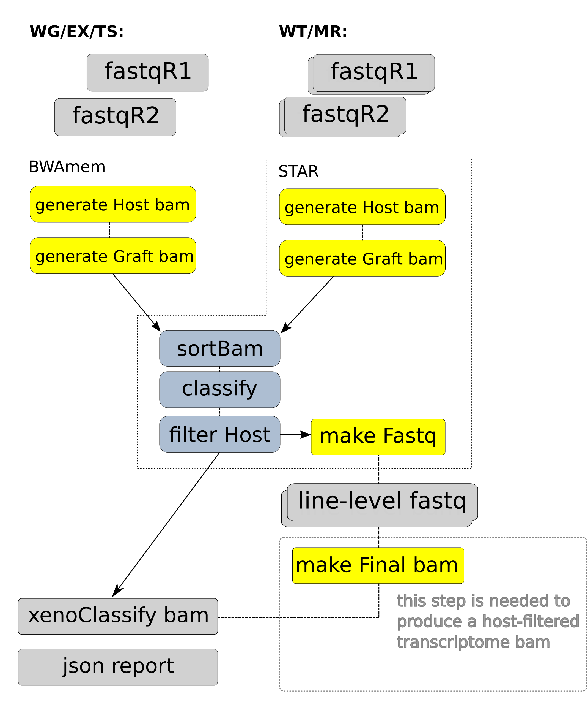

# xenoclassify-workflow

This Seqware workflow classifies short-read sequencing data generated from xenograft samples using [XenoClassify](https://github.com/oicr-gsi/xenoclassify).



## Usage

## Cromwell

``` 
 java -jar cromwell.jar run xenoclassify.wdl --inputs inputs.json 
```

## Running Pipeline

```
 python3 xenoclassify.py -H [hostBam] -G [graftBam] -O . -b -p [outputPrefix] \
                         -n [neitherThreshold] -t [tolerance] -d [difference]
```

The workflow will expect fastq inputs, one or two depending on the protocol used. Alignment is done with bwa mem aligner and the final step (classification) uses a python script relying on pysam library. By default, data are analyzed using human and mouse reference assemblies. Data may be also analyzed for other organisms.

## Optional Assembly-specific Parameters:

hg19 or mm10-specific data, for other assemblies these should be changed:

Paramter|Value
---|---
fastqR1 | File (required, mate 1 fastq for analysis)
fastqR2 | File? (optional, mate 2 file for paired sequencing)
refHost | String? (optional, default $MM10_BWA_INDEX_ROOT/mm10.fa)
refGraft | String? (optional, default $HG19_BWA_INDEX_ROOT/hg19_random.fa)
outputFileNamePrefix | (optional, custom file prefix. Default is fastqR1 basename)
bwaMemModules | String (optional, modules for bwaMem sub-workflow

## Other Parameters with default values:

Classify parameters use various settings for mapping score of reads, these are for tuning the classification process.

Paramter|Value
---|---
sortBam.jobMemory | Int? default is 10 gigabytes
sortBam.modules | String? (optional, default is samtools/0.1.19)
sortBam.timeout | Int (no need to set it, default is 72hr)
classify.modules | String? (optional, default is xenoclassify/1.0, module with classify script)
classify.jobMemory | Int? default is 10 gigabytes
classify.neitherThreshold | Int? parameter for classify script, default is 20
classify.tolerance | Int? parameter for classify script, default is 5
classify.difference | Int? parameter for classify script, default is 5
classify.timeout | Int (no need to set it, default is 72hr)
filterHost.modules | String? (optional, default is samtools/0.1.19)
filterHost.jobMemory | Int? (optional, default is 5 gigabytes)
filterHost.timeout | Int (no need to set it, default is 72hr)
filterHost.filterTags |  Array[String] array of tags to remove respective reads

## Required Inputs:

Paramter|Value
---|---
fastqR1 | File (required, mate 1 fastq for analysis)

Only one parameter is required, fastqR1. Normally this workflow would run with two fastq files as inputs (as paired sequencing data prevails at the moment)

## Outputs

Output | Type | Description
---|---|---
`filteredResults`|File|bam with filtered results (no host reads)
`jsonReport`|File|json file with simple stats showing numbers for different classification tags

## Niassa + Cromwell

This WDL workflow is wrapped in a Niassa workflow (https://github.com/oicr-gsi/pipedev/tree/master/pipedev-niassa-cromwell-workflow) so that it can used with the Niassa metadata tracking system (https://github.com/oicr-gsi/niassa).

* Building
```
mvn clean install
```

* Testing
```
mvn clean verify \
-Djava_opts="-Xmx1g -XX:+UseG1GC -XX:+UseStringDeduplication" \
-DrunTestThreads=2 \
-DskipITs=false \
-DskipRunITs=false \
-DworkingDirectory=/path/to/tmp/ \
-DschedulingHost=niassa_oozie_host \
-DwebserviceUrl=http://niassa-url:8080 \
-DwebserviceUser=niassa_user \
-DwebservicePassword=niassa_user_password \
-Dcromwell-host=http://cromwell-url:8000
```

## Support

For support, please file an issue on the [Github project](https://github.com/oicr-gsi) or send an email to gsi@oicr.on.ca .

_Generated with generate-markdown-readme (https://github.com/oicr-gsi/gsi-wdl-tools/)_
